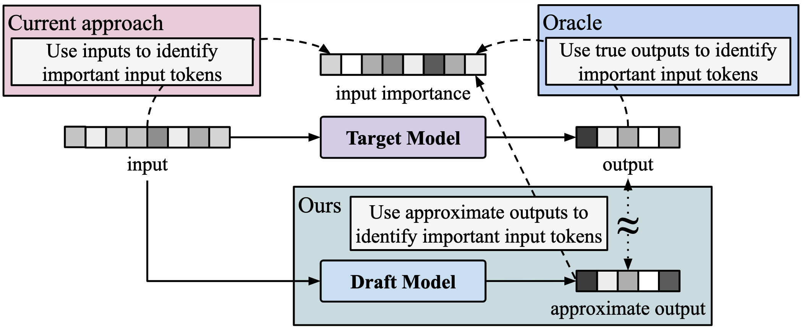

# Draft-based Approximate Inference for LLMs

<p align="center">
      <a href="https://scholar.google.com/citations?user=G1EpeWYAAAAJ&hl=en" target="_blank">Kevin Galim</a><sup>1*</sup>, 
      <a href="https://scholar.google.com/citations?user=H1hMLnkAAAAJ&hl=en" target="_blank">Ethan Ewer</a><sup>2*</sup>, 
      <a href="https://scholar.google.com/citations?user=Q-ARWkwAAAAJ&hl=eh" target="_blank">Wonjun Kang</a><sup>1,3</sup>, 
      <a href="https://scholar.google.com/citations?user=XJXKp60AAAAJ&hl=en" target="_blank">Minjae Lee</a><sup>1</sup>, 
      <a href="http://cvml.ajou.ac.kr/wiki/index.php/Professor" target="_blank">Hyung Il Koo</a><sup>1,4</sup>, 
      <a href="https://kangwooklee.com/aboutme/" target="_blank">Kangwook Lee</a><sup>2</sup>
  </p>
  <p  align="center">
    <sup>1</sup>FuriosaAI, <sup>2</sup>UW-Madison, <sup>3</sup>Seoul National University, <sup>4</sup>Ajou University
   </p>
<p align="center">
    <a href="https://arxiv.org/abs/2506.08373">
        
    </a>
</p>

<p align="center">

</p>

## TL;DR
We leverage draft models to more accurately identify important tokens and key-value pairs in long-context LLMs. Our proposed methods, **SpecKV** and **SpecPC**, enable smarter KV cache eviction and prompt compression, achieving more precise approximate inference compared to existing techniques.

## Abstract 
Optimizing inference for long-context Large Language Models (LLMs) is increasingly important due to the quadratic compute and linear memory complexity of Transformers. Existing approximation methods, such as key-value (KV) cache dropping, sparse attention, and prompt compression, typically rely on rough predictions of token or KV pair importance. We propose a novel framework for approximate LLM inference that leverages small draft models to more accurately predict the importance of tokens and KV pairs. Specifically, we introduce two instantiations of our proposed framework: (i) **SpecKV**, which leverages a draft output to accurately assess the importance of each KV pair for more effective KV cache dropping, and (ii) **SpecPC**, which uses the draft model’s attention activations to identify and discard unimportant prompt tokens. To the best of our knowledge, this is the first work to use draft models for approximate LLM inference acceleration, extending their utility beyond traditional lossless speculative decoding. We motivate our methods with theoretical and empirical analyses, and show a strong correlation between the attention patterns of draft and target models. Extensive experiments on long-context benchmarks show that our methods consistently achieve higher accuracy than existing baselines, while preserving the same improvements in memory usage, latency, and throughput. 

## 🚧 Code Release Coming Soon

Thank you for your interest in our work!

We are actively working on preparing the codebase for public release. The code, along with documentation and example usage, will be made available here once it is ready.

Stay tuned!

*For questions or collaboration inquiries, please contact us or open an issue.*


## Citation

```bibtex
@article{galim2025draft,
  title={Draft-based Approximate Inference for LLMs},
  author={Galim, Kevin and Ewer, Ethan and Kang, Wonjun and Lee, Minjae and Koo, Hyung Il and Lee, Kangwook},
  journal={arXiv preprint arXiv:2506.08373},
  year={2025}
}
```
